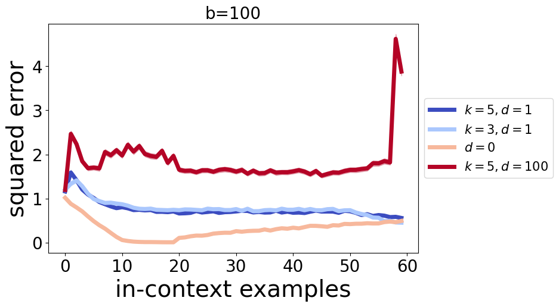
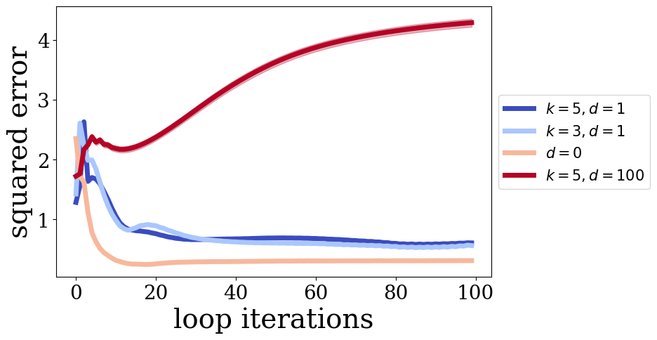
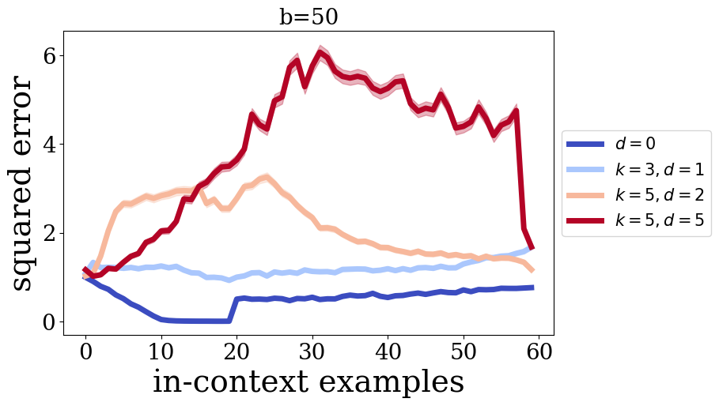
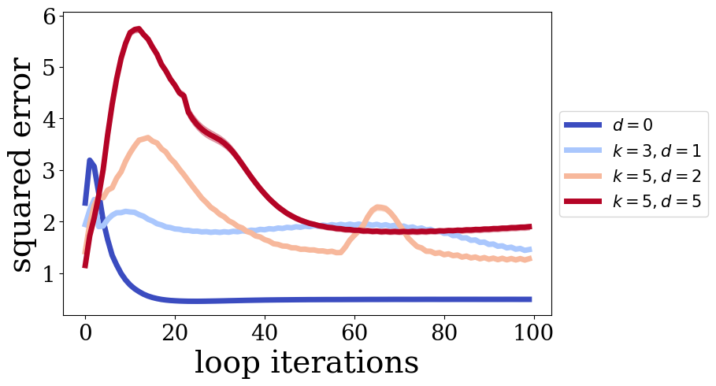
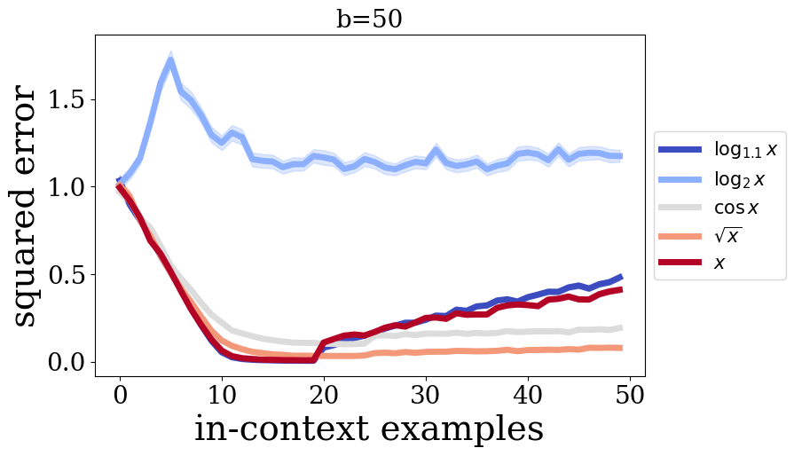
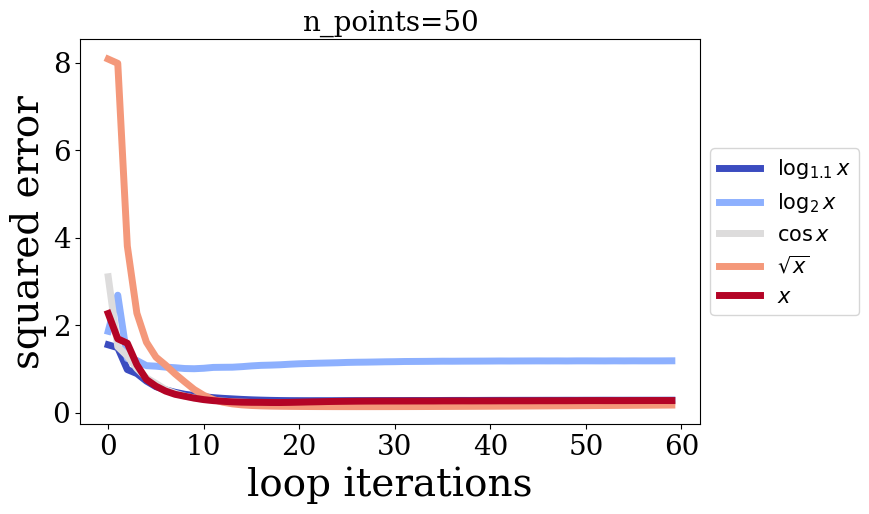

# Results
To accelerate training, the maximum number of points in the prompt $P$ during training was reduced to `n_points=20`, and the maximum dimensionality to `n_dims=10`. The maximum number of cycles $b$ was set to `n_loops=20`, and $T$ was set to `n_loop_windows=5`. The number of training steps was 75,000, and model sizes were also reduced; see [configs/](./configs/) for details.

Most experiments were conducted on classical linear regression tasks.

## Fewer Tokens
Several experiments were conducted where each subsequent iteration of the cycle passed $d$ fewer tokens. That is, after the first iteration, the model received the last $n-d$ tokens; after the second, $n-2d$ tokens, and so on, down to a minimum token count $k$. During training, this approach increased the average number of iterations per second by **1.7 times**.

Below are graphs showing model error relative to the number of tokens in the context (after 100 cycles) and the number of cycles.

As a result, models that passed only part of the tokens to the next cycle had lower accuracy across all iterations and points. This might be due to undertraining caused by the reduced data volume. Furthermore, when only 5 tokens were retained immediately after the first iteration ($k=5$, $d=100$), the model failed to train altogether.

Interestingly, models that did not pass all tokens retained comparable accuracy for longer sequences, unlike the $d=0$ model.

Below are similar graphs for models trained with `n_loops=30` and `n_loops_window=10`. With a large token removal step, the model also trained poorly.

## Curriculum
The impact of curriculum learning on model quality was also investigated. The idea was to gradually increase the number of steps during which the number of points/dimensions/cycles remained fixed, allowing the model to train before increasing task complexity.

In addition to a linear curriculum, the following variations were tested, as shown in the graphs. All models were trained with `n_loops=20`, `n_points=20`, and `n_loop_windows=5`.

As shown, increasing the number of cycles preserves average accuracy. Notably, the model with a linear curriculum achieved the best results for prompt sizes matching those used in training. However, with larger prompts, its accuracy declined, while models using $\sqrt{x}$ and $\cos{x}$ curricula experienced a slower drop in accuracy. This could be because the uneven prompt length changes helped models better adapt to varying prompt sizes. In the case of the $\log_2{x}$ curriculum, it did not reach the maximum number of cycles by the end of training, so the model likely failed to generalize to larger cycle and point counts.

## Additional Observations
- During implementation, it was observed that in the authors' original code, with each cycle iteration, positional encoding and layer normalization were reapplied in addition to the transformer block. Models were tested where these layers were only applied before the first and after the last cycle, aligning with multiple transformer blocks sharing parameters (_in a classic transformer, positional encoding is applied only once_). However, such models performed worse. It is unclear why this happens—possibly positional information is so critical to each cycle iteration that the model performs poorly without it. Another hypothesis is that repeated layer normalization stabilizes training. However, there was not enough time for more detailed experiments.
- The use of two blocks per cycle iteration was briefly explored. The model, after running half as many iterations, achieved errors comparable to a single-block model.
