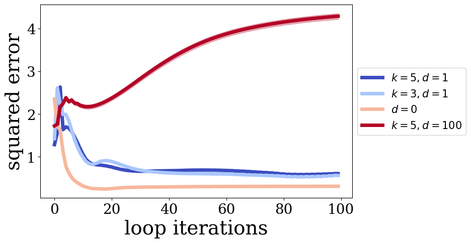
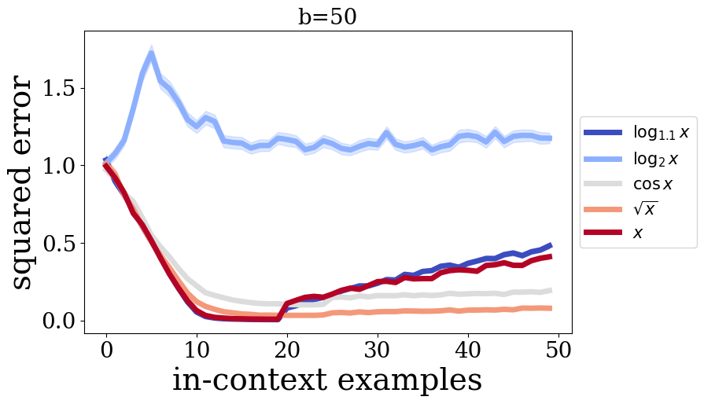

# Результаты
Для ускорения обучения, максимальное число точек в промпте $P$ при обучении было уменьшено до `n_points=20`, а максимальная размерность до `n_dims=10`. Максимальное число циклов $b$ равно `n_loops=20` и $T$ равно `n_loop_windows=5`. Шагов обучения - 75000, размер моделей также был уменьшен, для деталей см. [configs/](./configs/). 

По большей части эксперименты проводились на задачах классической линейной регрессии.

## Меньше токенов
Было проведено несколько экспериментов, когда на каждую следующую итерацию цикла передается на $d$ меньше токенов. То есть, после первой итерации цикла в модель передается $n-d$ последних токенов, после второй $n-2d$ и так далее, до минимального числа токенов $k$. При обучении это позволяет увеличить среднее количество итераций в секунду __в 1.7 раз__.

Ниже представлены графики ошибки моделей по количеству токенов в контексте (после 100 циклов) и по числу циклов.

В результате модели, которые передавали на следующий цикл только часть токенов имеют меньшую точность но всех итерациях и точках. Возможно это связано с тем, что модели недообучились из-за меньшего числа данных. Также, если в модели оставить только 5 токенов сразу после первой итерации `k=5, d=100`, то модель не смогла обучиться вообще.

Интересно, что модели у которых передавались не все токены сохранают ту же точность и для более длинных последовательностей, в отличии от модели с `d=0`.

Ниже представлены аналогичные графики для моделей, обученных с `n_loops=30` и `n_loops_window=10`. При выборе большого шага удаления токенов, модель также очень плохо обучается.

## Curriculum
Также было исследовано, как Curriculum влияет на качество моделей. Идея заключалась в том, чтобы постепенно увеличивать количество шагов на котором количество точек/измерений/циклов фиксировано, чтобы модель успела обучиться перед увеличением сложности задачи.

Таким образом помимо линейного curriculum, были опробованы следующие варианты, указанные на графиках. Все модели обучались с максимальным `n_loops=20` и `n_points=20`, и `n_loop_windows=5`. 

Как видно, при увеличении числа циклов модели сохраняют среднюю точность. Причем модель с линейным curriculum находит наиболее оптимальное решение для точек из промптов, где их размер, такой-же как в промптах из обучения. Однако при большем количестве, точность начинает падать, тогда как модели с curriculum $\sqrt{x}$ и $\cos{x}$, теряют её медленнее. Возможно из-за того, что длины промптов менялись неравномерно, модели смогли лучше адаптироваться под изменение их длины. В случае модели с $\log_2{x}$, то curriculum в ней не смог дойти до максимального числа циклов к концу итераций обучения, поэтому скорее всего модель не может обобщать на большее число циклов и точек.

## Другие наблюдения
- В процессе реализации было замечено, что в оригинальном коде авторов, при каждой итерации цикла в моделе помимо блока трансформера в данные повторно добавляется positional encoding и layer norm. Были рассмотрены модели, когда эти слои находятся только перед первым циклом и после последнего соответственно, тем самым соотвестсвуя нескольким блокам трансформера с общими параметрами (_в классическом трансформере позиционное кодирование происходит только один раз_). Однако, такие модели показали себя хуже. Пока сложно сказать почему так происходит, возможно информация о позиции настолько важна для каждой итерации цикла, что без неё модель работает хуже. Другая гипотеза заключается в том, что стабилизирует обучение именно повторное применение layer norm, однако на данный момент не хватило времени для более детальные эксперименты.
- Также немного было затронуто использование 2-ух блоков вместо 1-го для каждой итерации цикла. Модель, пройдя в 2 раза меньше итераций, достигла сравнимой ошибки для модели с 1 блоком.